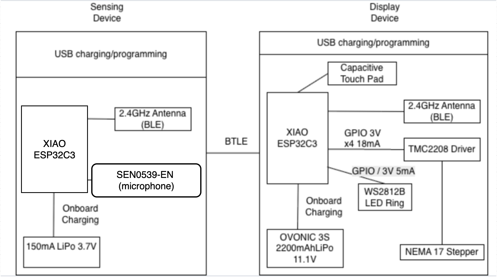

# Title, Description, Sketch

### Bloop
An interactive desk companion featuring a magnetically-controlled ferrofluid that responds to hand gestures (and potentially audio commands in the future). The creature exhibits lifelike behaviors through computer vision and wireless control. Core Behaviors:

Follow - Tracks and follows user's face position
Hide - Rotates away from user (shy behavior)
Spin - Runs around the track once

### Physical Features
A circular acrylic platform (12" diameter) contains ferrofluid in carved tracks. Beneath the platform, a stepper motor controls an arm with an embedded magnet rotates to manipulate the fluid. An LED ring provides ambient lighting and behavioral feedback.

# Sensor Device

### ESP32-CAM Vision Sensor
The sensing device uses an ESP32-CAM module with an integrated OV2640 2-megapixel camera to detect and track user interactions. The camera runs a motion detection algorithm to identify the user's position and gestures.

### Functionality
Face Tracking: Computer vision algorithms detect faces and calculate the X-axis position to enable smooth tracking behavior
Gesture Recognition: Identifies specific hand gestures including circle (trigger "Spin"), face covering (trigger "Hide"), and wave over (trigger "Follow")
Wireless Communication: Transmits position data and behavior commands to the display device via ESP-NOW protocol (2.4GHz WiFi)

The device is powered by a 150mAh 3.7V LiPo battery with USB charging, making it portable and easily repositionable. 

# Display Device

### Magnetically-Actuated Ferrofluid Platform
The display device features a laser-cut circular acrylic platform with ferrofluid in carved tracks. A NEMA 17 stepper motor beneath the platform rotates a vertical arm assembly, positioning a neodymium magnet 1-2mm under the ferrofluid. The TMC2208 driver provides silent operation with microstepping for smooth, organic motion.

An ESP32-C3 microcontroller receives wireless commands and controls motor movements. A WS2812B LED ring (16 LEDs) provides visual feedback with color-coded patterns. A capacitive touch pad enables power control, and an 11.1V 2200mAh LiPo battery provides power and allows portability.

As the magnet rotates, the ferrofluid forms dramatic spikes that follow the magnetic field, creating lifelike tracking behaviors that respond to user movements detected by the camera.

# Communication Between Devices

